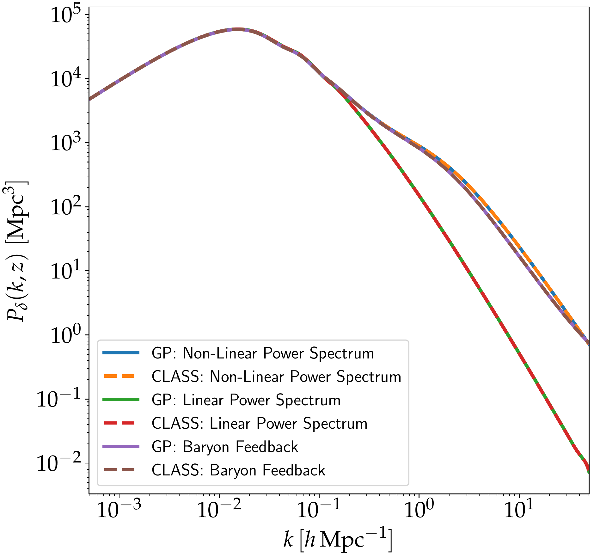

Basic Setup
-----------
There are multiple possibilities which we consider when building the emulator. All the configurations are provided in a setting file `here <https://github.com/Harry45/emuPK/blob/main/emulator/settings.py>`_. In particular, one can emulate the 3D matter power spectrum directly or one can decompose it into three components as:

:math:`P_{\delta}(k,z)=A(z)[1+q(k,z)]P_{\text{lin}}(k,z_{0})`

If we choose to do the latter, then this can be specified using

.. code-block:: python
	
	components = True

Moreover, one can choose to include the neutrino mass in the emulating scheme. If one opt not to do so, the neutrino mass can be fixed to a value. In many weak lensing analysis, this mass is fixed to 0.06 eV. 

.. code-block:: python

	neutrino = False

	if not neutrino:
	    fixed_nm = {'M_tot': 0.06}

Once the LHS points are generated and scaled according to the range of cosmological values we want, we found that CLASS gets permanently stuck at some of these points. Hence, to acoid this, we allocate a timeslot to allow CLASS to run (below, we have fixed it to 60 seconds). On average, the time taken for a single forward simulation is around 30 seconds, hence can be used as a guide to fix the value below.

.. code-block:: python

	timeout = 60

Next, we consider the lower and upper limits of redshift and wavenumber. The minimum and maximum redshift can be set using the variables :code:`zmin` and :code:`zmax` respectively. However, for :math:`k`, for accurate power spectrum calculation, :math:`k_{\text{max}}`, :code:`k_max_h_by_Mpc` below is set to a very high value (private communication with CLASS developers). However, when calculating the power spectrum, we define another variable, :code:`kmax` (which is less than the other one) to set the upper limit of :math:`k`.

.. code-block:: python

	# minimum redshift
	zmin = 0.0

	# maximum redshift
	zmax = 4.66

	# for accurate power spectrum, set to a very high value, for example, 5000
	k_max_h_by_Mpc = 5000.

	# our wanted kmax
	kmax = 50.0

	# minimum of k
	k_min_h_by_Mpc = 5E-4

Example
-------
A `notebook <https://github.com/Harry45/emuPK/blob/main/emulator/playground.ipynb>`_ is available on Github to illustrate the different test cases. Below we show an example of the different reconstructed power spectra (comparing the power spectra generated using the emulator and the solver, CLASS). In particular, we have the 

- linear matter power spectrum at the reference redshift
- the non-linear matter power spectrum at a fixed redshift
- the non-linear matter power spectrum, with baryon feedback at a fixed redshift

and we can also use a specific redshift distribution to compute the auto- and cross- weak lensing power spectra. 

   Comparison between the emulator and CLASS at fixed redshift and input parameters.

